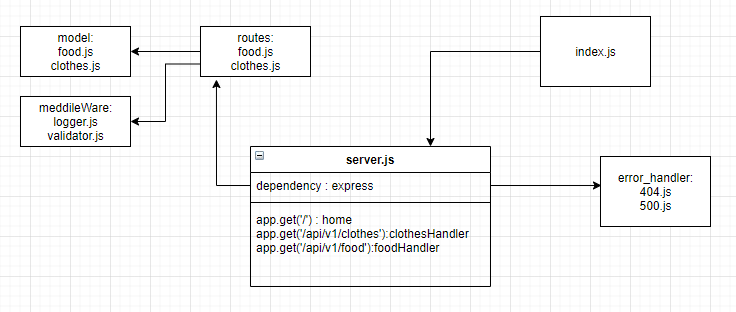

# basic-api-server


## About

*  REST API using Express, by creating a proper series of endpoints that perform CRUD operations on a database, using the REST standard

## Author
Furat Malkawi

# Links 

  [Deployed app](https://furat-basic-api.herokuapp.com)


  [Error report](https://github.com/furatmalkawi29/basic-api-server/actions)


## Setup

`.env` 
`cors`  
`dotenv`  
`express`  
`morgan`  
`uuid`  
`jest`  
`supertest`  
PORT - Port Number

## Running the app
- npm start
   - Endpoint: /
Returns Object

{
  you are in the home page
}

  - Endpoint: /api/v1/food/

Returns Object
```
localhost:3000/api/v1/food/

{
    "id": "c89686d4-d4cd-4410-943c-dde2ef133b85",
    "data": {
        "name": "pizza",
        "type": "fast-food"
    }
}
```
  - Endpoint: /api/v1/clothes/

Returns Object
```
{
    "id": "c89686d4-d4cd-4410-943c-dde2ef133b85",
    "data": {
        "name": "pizza",
        "type": "fast-food"
    }
}
```

UML 

